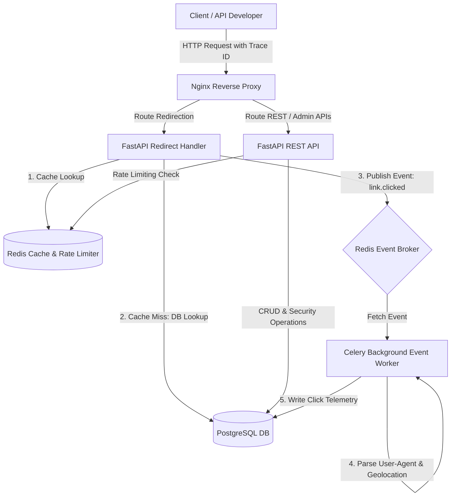

# LinkForge

### Enterprise Link Management & Analytics Platform

LinkForge is a high-performance, multi-tenant backend platform designed as a production-grade modular monolith. It demonstrates modern backend software engineering concepts including shared-database SaaS isolation, token refresh session rotation, custom audit logs, request tracing, and asynchronous query pooling.

---

## Current Status

*   **Current Version**: `v0.2.0` (Identity & Tenant Management Service)
*   **Completed Milestones**:
    *   **Milestone 1**: Foundation setup (Scaffolding, Async PG Database setups, custom logging, and health probes).
    *   **Milestone 2**: Identity Service (SaaS organizations, User management, Argon2id passwords, and JWT session rotation).
*   **Current Milestone**: **Milestone 3**: Link Engine (Base62 URL shortening, expiring link rules, and routing).
*   **Upcoming Milestones**: Redis read-through caching, Redis token bucket rate limiting, Celery click telemetry processing, Prometheus metric scraping, and API Key validation.

---

## Backend Engineering Concepts Demonstrated

This platform showcases the following production-grade backend engineering concepts:

*   **Multi-Tenant Architecture**: Tenant isolation using a shared-database, shared-schema pattern scoped strictly via tenant keys (`organization_id`).
*   **Vertical Slice Architecture**: Features grouped by cohesive capabilities (auth, users, organizations, etc.) rather than decoupled layers.
*   **JWT & HTTP Bearer Authorization**: Stateless authentication via symmetric HS256 JWT tokens transmitted over standard HTTP Bearer headers.
*   **Refresh Token Rotation (RTR)**: Stateful session rotation tracking with Postgres hash validation. Replaying a token triggers immediate family session revocation.
*   **HttpOnly Cookie Protection**: Refresh tokens delivered in secure `HttpOnly`, `SameSite=Lax` cookies scoped strictly to the `/api/v1/auth` path.
*   **Role-Based Access Control (RBAC)**: Authorization checks using a typed Python `UserRole` enum (`owner`, `admin`, `member`, `viewer`).
*   **Asynchronous Database Access**: Non-blocking queries executing over SQLAlchemy 2.0 (`AsyncSession`) and `asyncpg`.
*   **Declarative Schema Migrations**: Version-controlled PostgreSQL table schemas managed using Alembic.
*   **Request Tracing Middleware**: End-to-end tracing propagating unique correlation tokens (`X-Request-ID`) across async calls.
*   **Structured JSON Logging**: Rich logging scopes mapped using `structlog` formatting (JSON in production, colorized in development).

---

## System Architecture

LinkForge is structured as a modular monolith. Slices communicate via in-memory service layers to keep latency low while enforcing high database-level boundaries.



---

## Technology Stack

### Implemented Infrastructure (Core Stack)
| Layer | Technology | Purpose |
| :--- | :--- | :--- |
| **API Framework** | FastAPI | Asynchronous REST routing |
| **Runtime Engine** | Python 3.13 | Backend application interpreter |
| **Database** | PostgreSQL 16 | Relational data repository |
| **ORM** | SQLAlchemy 2.0 | Asynchronous query mapper |
| **Migrations** | Alembic | Schema versioning |
| **Testing** | Pytest | Async integration tests with isolated rollbacks |
| **Logging** | Structlog | Context-rich JSON structured logging |

### Planned Infrastructure (Target Stack)
| Layer | Technology | Purpose |
| :--- | :--- | :--- |
| **Cache & Limiter** | Redis 7 | Read-through caching, rate limit tokens, and event queuing |
| **Event Pipeline** | Celery | Asynchronous background telemetry parsing |
| **Observability** | Prometheus / Grafana | Telemetry metric collection and dashboard reporting |

---

## Project Structure

```text
linkforge/
├── alembic/                 # Database migrations and version scripts
├── app/                     # Core application source
│   ├── api/                 # Core API dependencies and security schemes
│   ├── core/                # Database engines, configurations, and logger settings
│   ├── middleware/          # HTTP middlewares (request correlation tracking)
│   └── features/            # Feature slices (Vertical Slices)
│       ├── audit/           # Security audit event logs
│       ├── auth/            # Token generation, logins, logout, and RTR helpers
│       ├── health/          # System connection status checks
│       ├── organizations/   # SaaS organizations (Tenants)
│       └── users/           # User credentials and RBAC
├── docs/                    # Schema models and architecture specs
├── tests/                   # Automated pytest suites (isolated transactional DB test beds)
├── docker-compose.yml       # Docker configurations for PostgreSQL and Redis services
├── pytest.ini               # Test configuration properties
└── requirements.txt         # Core dependencies manifest
```

---

## Getting Started

### Prerequisites
*   [Docker Desktop](https://www.docker.com/products/docker-desktop/) (v20.10+)
*   [Python 3.13](https://www.python.org/downloads/)

### Installation & Run Steps
1.  Initialize virtual environment:
    ```bash
    python -m venv .venv
    ```
2.  Activate the environment:
    *   **Windows**: `.venv\Scripts\activate`
    *   **Linux/macOS**: `source .venv/bin/activate`
3.  Install dependencies:
    ```bash
    pip install -r requirements.txt
    ```
4.  Copy environment configurations:
    Create a `.env` file in the root directory (referencing `.env.example`).
5.  Launch local database services:
    ```bash
    docker compose up -d
    ```
6.  Apply database tables:
    ```bash
    alembic upgrade head
    ```
7.  Run the web server:
    ```bash
    uvicorn app.main:app --reload
    ```
8.  Execute tests:
    ```bash
    python -m pytest
    ```

API specs are interactive and available locally at [http://localhost:8000/docs](http://localhost:8000/docs).

---

## License

Distributed under the MIT License. See `LICENSE` for details.
