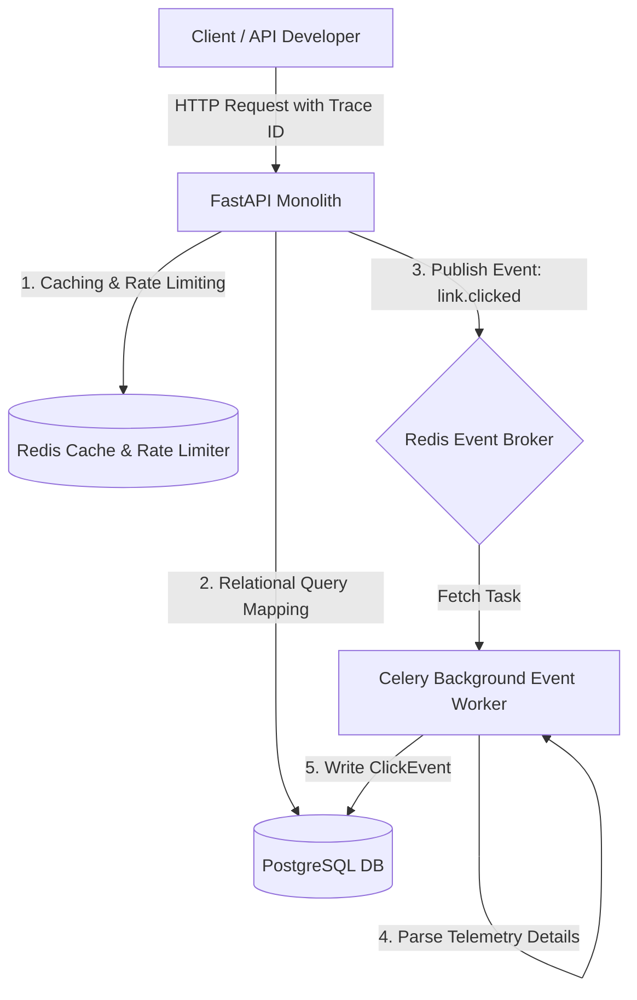

# LinkForge

### Enterprise Link Management, Analytics & API Infrastructure Platform

LinkForge is a high-performance, multi-tenant link management and redirection engine built as an enterprise-grade modular monolith. It is designed to demonstrate production-level software engineering patterns, including shared-database SaaS isolation, secure API credentialing, rate limiting, and real-time asynchronous telemetry pipeline.

---

## Technical Features Overview

### 🔒 Enterprise Security & Identity
- **Multi-Tenant Scoping**: Enforces strict database-level tenant isolation using a shared-database, shared-schema pattern scoped by tenant key (`organization_id`).
- **Refresh Token Rotation (RTR)**: Implements stateful session rotation with PostgreSQL hash validation. Replaying a rotated/revoked token triggers immediate revocation of the user's entire session family.
- **Unified Authentication Pipeline**: Reusable middleware validating either standard **JWT Bearer** headers (for web clients) or **X-API-Key** headers (for programmatic clients), seamlessly preserving tenant scoping and Role-Based Access Control (RBAC).
- **Secure Password & Key Hashing**: Plaintext user passwords and programmatic API keys are never stored. Both are secured using **Argon2id** (OWASP-recommended parameters).

### ⚡ Redirection & Caching Engine
- **Base62 URL Shortening**: High-performance shortening mapping to database-persisted URLs and custom aliases.
- **Redis Read-Through Cache**: Evades database roundtrips by serving redirection requests directly from Redis, featuring active cache eviction upon metadata edits and offline connection resiliency.
- **Lua Redis Rate Limiter**: Distributed Token Bucket rate limiter implemented directly on Redis using Lua scripts for atomic execution.

### 📊 Real-Time Analytics Pipeline
- **Asynchronous Telemetry Worker**: Redirection event logging is decoupled from the user request path. Redirection nodes publish events to a Redis queue, and a **Celery** background worker consumes, parses, and writes click metadata.
- **Device & Footprint Parsing**: Extracts browser, operating system, and device types, and hashes visitor IPs using SHA-256 for privacy compliance.
- **Area-Chart Time Series**: Real-time traffic metrics, KPI scorecards, and platform footprint distributions.

---

## Current Feature Matrix

| Feature Area | Capabilities | Status |
| :--- | :--- | :--- |
| **Authentication & IAM** | Multi-Tenancy (Tenant Scoping) | ✓ Implemented |
| | JWT Bearer Authentication | ✓ Implemented |
| | Refresh Token Rotation (RTR) | ✓ Implemented |
| | Role-Based Access Control (RBAC) | ✓ Implemented |
| | Programmatic X-API-Key Authentication | ✓ Implemented |
| **Link Engine** | Base62 Conversion & Redirection | ✓ Implemented |
| | Custom Aliases & Expirations | ✓ Implemented |
| | Deactivation & Reactivation Lifecycle | ✓ Implemented |
| | Cursor-based Pagination & Search | ✓ Implemented |
| **Caching & Middleware** | Redis Read-through Cache | ✓ Implemented |
| | Post-Commit Active Cache Eviction | ✓ Implemented |
| | Distributed Lua Token Bucket Rate Limiter | ✓ Implemented |
| **Asynchronous Telemetry**| Celery click worker event pipeline | ✓ Implemented |
| | User-Agent parsing & IP hashing | ✓ Implemented |
| **Observability** | Prometheus client scrapers | ✓ Implemented |
| | Endpoint path normalization middleware | ✓ Implemented |
| | Latency tracking scorecards | ✓ Implemented |

---

## API Key Management & Authentication

LinkForge includes a production-grade API Key management system modeled after Stripe, GitHub, and OpenAI:

1. **Secure Generation**: Plaintext keys are generated using cryptographically secure tokens prefixed with their environment: `lf_live_...` (Production) or `lf_test_...` (Testing).
2. **One-Time Reveal**: Plaintext keys are returned exactly once upon creation or regeneration, and are never retrievable again.
3. **Argon2id Hashing**: Plaintext keys are hashed using Argon2id before database storage.
4. **Prefix Lookup**: Because Argon2id hashes are non-deterministic, LinkForge indexes and queries key records using the deterministic `key_prefix` (e.g., `lf_live_xxxxxxxx`), then performs hash verification in memory.
5. **Unified Authentication Dependency**: Authenticates either `Authorization: Bearer <JWT>` or `X-API-Key: <key>` headers, updating `last_used_at` dynamically for valid keys.

---

## System Architecture

LinkForge decouples web routing, caching, and background write jobs to maintain sub-millisecond response times:



---

## Technology Stack

### Backend Services
- **API Engine**: FastAPI (Asynchronous REST Routing)
- **Database Mapping**: SQLAlchemy 2.0 (Async Session) & `asyncpg`
- **Database Migrations**: Alembic
- **Caching & Rate Limiting**: Redis & Lua scripting
- **Task Queue**: Celery (Solo worker pool for development)
- **Observability**: Prometheus client (Metrics collection & normalization)
- **Passwords & Keys**: Argon2id (`argon2-cffi`)

### Frontend Dashboard
- **Web Library**: React 19 (TypeScript)
- **Build Tool**: Vite
- **CSS Styling**: Vanilla CSS & TailwindCSS
- **State & Queries**: TanStack Query v5 (Axios)
- **Routing**: React Router v6
- **Visualization**: Recharts (Area/Line Traffic Charts)

---

## Project Structure

```text
linkforge/
├── alembic/                 # Alembic migration revisions
├── app/                     # Python source files
│   ├── api/                 # Core API dependencies and security schemes
│   ├── core/                # Database engines, configurations, and logger settings
│   ├── middleware/          # HTTP middlewares (request correlation tracking)
│   └── features/            # Feature slices (Vertical Slices)
│       ├── api_keys/        # Key generation, Argon2id hashing, and X-API-Key dependencies
│       ├── analytics/       # Telemetry querying, time series, and footprinting services
│       ├── audit/           # Security audit event logs
│       ├── auth/            # Token generation, logins, logout, and RTR helpers
│       ├── health/          # System connection status checks
│       ├── links/           # Shortening, aliases, and redirect services
│       ├── organizations/   # SaaS organizations (Tenants)
│       └── users/           # User credentials and RBAC
├── frontend/                # React dashboard source
│   ├── src/
│   │   ├── app/             # Application entry providers & routes
│   │   ├── features/        # Frontend feature slices (dashboard, links, analytics, apiKeys)
│   │   ├── layouts/         # App layouts
│   │   └── shared/          # Shared components (Sidebar, Navbar, Dialogs, Toast)
├── tests/                   # Automated pytest suites (isolated transactional DB test beds)
```

---

## Development Roadmap

- [x] **Milestone 1: Foundation**: Scaffolding, Async DB setups, Request ID tracing, structured logging, health probes.
- [x] **Milestone 2: Identity Service**: Registration, Tenant Scoping, User management, JWT token issue, Audit Logging system.
- [x] **Milestone 3: Link Engine**: Base62 conversion mapping, URL Shortening engine, Custom Aliases, Expiration constraints, Redirection, atomic click count.
- [x] **Milestone 4: Caching**: Redis read-through caching, post-commit active eviction, and offline connection grace fallback.
- [x] **Milestone 5: Rate Limiting**: Distributed Token Bucket rate limiting middleware utilizing Redis TIME and Lua scripting.
- [x] **Milestone 6: Asynchronous Telemetry**: Redis task queue, Celery background worker, User-Agent browser/OS/device metadata parsing, SHA-256 IP privacy hashing, database savepoint idempotency.
- [x] **Milestone 7: Observability**: Prometheus client metrics integration, HTTP request latency tracking, low-cardinality endpoint normalization middleware, allowed/blocked rate limits, and passive metrics scraping.
- [x] **Milestone 8: Overview Dashboard**: greeting headers, platform health telemetry, SLA metrics.
- [x] **Milestone 8.3: Enterprise Link Management**: custom aliases, expirations, filters, drawer panels.
- [x] **Milestone 9: Analytics Dashboard**: time series graphs, top browser/device distribution charts.
- [x] **Milestone 10: API Keys Management**: Argon2id prefix-hashed keys, environment scoping, one-time reveal dialog, unified authentication middleware.
- [ ] **Milestone 11: Events Timeline** (Planned)
- [ ] **Milestone 12: Team Management** (Planned)
- [ ] **Milestone 13: Workspace Settings** (Planned)
- [ ] **Milestone 14: Infrastructure Dashboard** (Planned)
- [ ] **Milestone 15: Observability Dashboard** (Planned)
- [ ] **Milestone 16: Deployment & CI/CD** (Planned)

---

## Getting Started

### Prerequisites
*   [Docker Desktop](https://www.docker.com/products/docker-desktop/) (v20.10+)
*   [Python 3.13](https://www.python.org/downloads/)
*   [Node.js](https://nodejs.org/) (v20+)

### Installation & Run Steps

1.  **Initialize Backend Environment**:
    ```bash
    python -m venv .venv
    # Windows:
    .venv\Scripts\activate
    # Linux/macOS:
    source .venv/bin/activate
    
    pip install -r requirements.txt
    ```

2.  **Configure Environment**:
    Create a `.env` file in the root directory (referencing `.env.example`).

3.  **Launch Database & Redis Services**:
    ```bash
    docker compose up -d
    ```

4.  **Run Migrations & Seed**:
    ```bash
    alembic upgrade head
    ```

5.  **Start Services**:
    - **Backend Web Server**:
      ```bash
      uvicorn app.main:app --reload
      ```
    - **Celery Worker**:
      ```bash
      celery -A app.core.celery worker --loglevel=info
      ```
    - **Frontend App**:
      ```bash
      cd frontend
      npm install
      npm run dev
      ```

6.  **Run Backend Tests**:
    ```bash
    python -m pytest
    ```

Interactive Swagger API docs are accessible locally at [http://localhost:8000/docs](http://localhost:8000/docs). The Vite dev server runs at [http://localhost:5173](http://localhost:5173).

---

## License

Distributed under the MIT License. See `LICENSE` for details.
